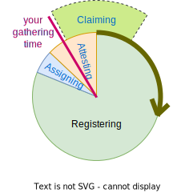
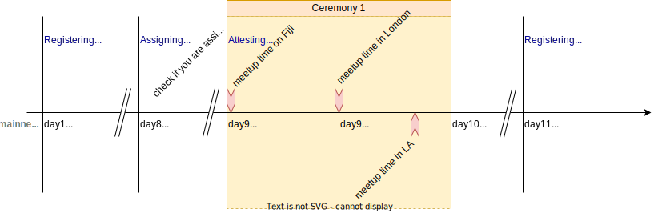

# The Encointer Ceremony Cycle

Encointer's proof-of-personhood protocol demands in-person participation in regular ceremony meetups.

## Ceremony Phases

The perpetual ceremony cycle is divided into three phases:

### Registering

During this phase, community members can register for the upcoming ceremony. 

It is also possible to register new communities or new meetup locations ONLY during this phase

If ceremony rewards have not already been claimed during *Attesting* phase, this can still be done now.

*Registering* is usually the longest phase in the cycle

### Assigning

At the beginning of this phase, the chain will close registrations and pick a random seed for meetup assignments.

Now it is time to check your [Encointer Wallet app](./app.md) if you have been assigned to the upgoming ceremony (making you an *assigninee*) and where you'll have to physically be present with your mobile at what precise time.

*Assigning* lasts for 24h to give people enough lead time between the moment when they know if the were assigned and where and the moment when they have to physically attend.

### Attesting

During this 48h phase, the ceremony meetups will be performed all around the world around local noon (high sun, actually).

Assignees will physically meet at their assigned locations and times and mutually attest their personhood and attendance (*attendees*). They send their attestations to the chain. In the happy flow, ceremony rewards (community issued income) can be claimed immediately after the last attendee has sent their attestations.

## Timing

On mainnet, the ceremonies currently happen in intervals of 10d. This interval is expected to be prolonged in the future, once the protocol has been tested enough.

On our testnets, the timing may be different and may change over time to allow for different test setups or public demos.

