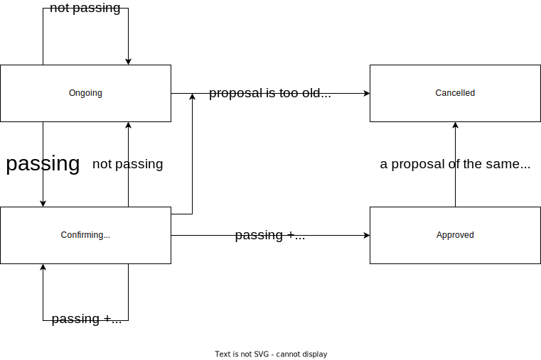

# Democracy V0.1

> this feature is work in progress and currently only deployed on [testnet Gesell](./testnet-gesell.md). See [Governance](./decentralization-governance.md) to learn how it currently works_on mainnet
>
> V0.1 only encompasses a subset of local community governance actions

The democracy module will bring decentralized governance to Encointer, facilitating participants to take decisions. Such a **universal human suffrage** (one person one vote) governance shall render the current Encointer council obsolete. Examples of such decisions are the addition of new meetup locations to a community, an adjustment of the Demurrage rate or changes in the ceremony schdeule.

The decision making process should follow the subsidiarity principle, meaning that decisions should be taken on the lowest possible level. So for example, if a community wants to extend their region by adding some new meetup locations, only community members should be allowed to participate in the vote.

## Scope of Democracy

This section describes the powers of Encointer's onchain democracy and at what level decisions are to be made.

### Protocol Changes

Changes to the Encointer protocol are out of scope because they need to be decided by Kusama Relay-Chain Governance as Encointer is a common good parachain. Upgrades to the Encointer Protocol must pass a public [referendum on Kusama](https://guide.kusama.network/docs/learn-governance/#referenda), where KSM token holders decide.

### Global Actions

These actions can only be decided upon by the quorum of all encointer communities globally

-   Adjust ceremony schedule (can be adjusted anytime)
    -   [`next_phase`](https://github.com/encointer/pallets/blob/91cbd7c9c0d47c4a80c096d3b2b501625a6bb724/scheduler/src/lib.rs#L151): force progress to next ceremony phase
    -   [`push_by_one_day`](push_by_one_day): postpone next phase change by one day push_by_one_day
    -   [`set_phase_duration`](https://github.com/encointer/pallets/blob/91cbd7c9c0d47c4a80c096d3b2b501625a6bb724/scheduler/src/lib.rs#L173): adjust ceremony schedule phase durations
    -   [`set_next_phase_timestamp`](https://github.com/encointer/pallets/blob/91cbd7c9c0d47c4a80c096d3b2b501625a6bb724/scheduler/src/lib.rs#L184): arbitrarily define the time for next phase change
-   Manage communities (can only be enacted during _Registering_ phase)
    -   [`new_community`](https://github.com/encointer/pallets/blob/91cbd7c9c0d47c4a80c096d3b2b501625a6bb724/communities/src/lib.rs#L76): Register new communities
    -   [`purge_community`](https://github.com/encointer/pallets/blob/91cbd7c9c0d47c4a80c096d3b2b501625a6bb724/communities/src/lib.rs#L299): well...
-   Manage Ceremony Parameters (may only make sense to enact during _Registering_ phase)
    -   [`set_min_solar_trip_time_s`](https://github.com/encointer/pallets/blob/91cbd7c9c0d47c4a80c096d3b2b501625a6bb724/communities/src/lib.rs#L279): security parameter to calculate minimal location distance
    -   [`set_max_speed_mps`](https://github.com/encointer/pallets/blob/91cbd7c9c0d47c4a80c096d3b2b501625a6bb724/communities/src/lib.rs#L289): security parameter defining the maximal speed over ground of an adversary
    -   [`set_inactivity_timeout`](https://github.com/encointer/pallets/blob/91cbd7c9c0d47c4a80c096d3b2b501625a6bb724/ceremonies/src/lib.rs#L386): define how many ceremonies a community can be idle before getting purged
    -   [`set_endorsement_tickets_per_bootstrapper`](https://github.com/encointer/pallets/blob/91cbd7c9c0d47c4a80c096d3b2b501625a6bb724/ceremonies/src/lib.rs#L396): define how many endorsement tickets bootstrappers should get to invite people they trust
    -   [`set_reputation_lifetime`](https://github.com/encointer/pallets/blob/91cbd7c9c0d47c4a80c096d3b2b501625a6bb724/ceremonies/src/lib.rs#L396): define how long proof-of-personhood reputation is valid for and stored
    -   [`set_meetup_time_offset`](https://github.com/encointer/pallets/blob/91cbd7c9c0d47c4a80c096d3b2b501625a6bb724/ceremonies/src/lib.rs#L396): finetune meetup time difference to high sun
-   Decide on Treasury Proposals

### Community Actions

These actions can be decided per community for themselves

Only to be changed during _Registering_ phase

-   [`add_location`](https://github.com/encointer/pallets/blob/91cbd7c9c0d47c4a80c096d3b2b501625a6bb724/communities/src/lib.rs#L143): add meetup location for community
-   [`remove_location`](https://github.com/encointer/pallets/blob/91cbd7c9c0d47c4a80c096d3b2b501625a6bb724/communities/src/lib.rs#L189): remove meetup location for community
-   [`update_nominal_income`](https://github.com/encointer/pallets/blob/91cbd7c9c0d47c4a80c096d3b2b501625a6bb724/communities/src/lib.rs#L258): the amount of basic income per ceremony per person per community

Not strictly related to a particular ceremony phase. could be adjusted anytime.

-   [`update_community_metadata`](https://github.com/encointer/pallets/blob/91cbd7c9c0d47c4a80c096d3b2b501625a6bb724/communities/src/lib.rs#L214): change name, currency, artwork IPFS cid for community
-   [`update_demurrage`](https://github.com/encointer/pallets/blob/91cbd7c9c0d47c4a80c096d3b2b501625a6bb724/communities/src/lib.rs#L238): change how fast balances are demurraged per community

### Petitions

Petitions are votes on matters that cannot automatically be enforced by the Encointer protocol. Therefore, they are non-binding for the network. They can have global or local scope. Petitions can be used to signal the network or community leaders about the will of the community.   

## Proposals

There is a set of predefined proposal _actions_ that can be voted on (ie. set basic income to XY)

Everyone can start a proposal on an _action_ (ie. set basic income to 48 LEU)

Every member of the community can use their reputation to vote on a proposal (the more reputation, the more voting power. Capped at _reputation_lifetime_)

A proposal gets approved if it is in a passing state (enough aye votes) for a long enough time period (confirmation period)

There can be multiple proposals up for vote simultaneously, even on the same action

When a proposal gets approved, all other proposals on the same _action_ get cancelled, to avoid conflicts

When a proposal A gets approved, its enactment will be scheduled to the beginning of the next ceremony cycle. Should another proposal B get approved after proposal A’s approval but before it’s enactment, proposal B will be scheduled for enactment and proposal A will be cancelled.

### Proposal Lifetime

The following examples will describe examples of how proposals change their state over time based on a changing number of votes and on other proposals.

Let

-   Confirmation Period = 3 units,
-   Proposal Lifetime = 12 units,
-   X/Y denote X aye votes and Y total votes,
-   O = Ongoing,
-   C = Confirming,
-   A = Approved,
-   X = Cancelled.

For the sake of simplicity, we assume that just a simple majority is needed for a proposal to pass and there is no minimum vote required.

In the case of multiple proposals, all proposals shall be of the same action.

### Practical Examples

Let's assume a proposal has been submitted at the end of the last *registering* phase. During the first day, the proposal doesn't reach the minimal turnout yet, but on day two it enters the passing state and the confirmation period starts. More people make up their mind and vote *Nay*, so the proposal fall out of confirming state before the end of the confirmation period. Over time, more *Aye* votes are coming in and the approval threshold is surpassed. This time, the proposal stays in the passing state during the entire confirmation period gets approved. 
Any community member can call the lazy evaluation and the proposal action will be scheduled for enaction at the start of the upcoming *registering* phase. 

Another example shows a proposal with insufficient approval. After an initial boost, it stays in the *failing* state until the the end of its lifetime. Any community member can request lazy evaluation and the proposal will be cancelled.

## Voting

### Eligible Reputations

We currently allow only reputations older than the ceremony cycle of the proposal start - 2 to participate in the vote. This is because the count of those reputations is not subject to change anymore. We need a reliable count of all eligible reputations in order to determine the maximum amount of possible votes, which is required 1. for AQB and 2. to determine the minimum turnout.

If we want to relax this in the future, we would need to come up with a way to handle the dynamic change of the electorate while a proposal is running. This is not trivial.

Your own voting power depends on the number of cycles you have attended during the eligible period. The more cycles you have attended, the more voting power you have. This is a sybil-resilient approximation of universal suffrage.

### Adaptive Quorum Biasing (AQB) and Minimum Approval

In order to determine if a proposal is passing, we use positive turnout bias. The approval threshold follows the formula: \\(thrs = \frac{1}{1+\sqrt{turnout}}\\) where \\(turnout \in [0, 1]\\) and \\(thrs \in [0, 1]\\)

In addition we enforce a minimum turnout of 5%.

The goal of AQB is to ensure proposals can be approved even if turnout is low. Especially noncontroversial proposals may suffer from low turnout as they fail to mobilize the crowd. However, low turnout should require a higher approval rate to pass.

The blue trace depicts a possible turnout over time. It can be expected that the initiators of a proposal will immediately vote *Aye*, leading to very high approval at start. As long as less than 5% of the elecorate have cast their vote, the proposal is in *failing* state. Over time, more people will make up their mind and the proposal may flip between passing and failing state several times before eventually staying in the passing state for the confirmation period. The end of the confirmation period is depicted by the blue dot.  

## Tutorial

For a tutorial of the democracy module, please see the [Democracy Tutorial](./tutorials-democracy.md)
