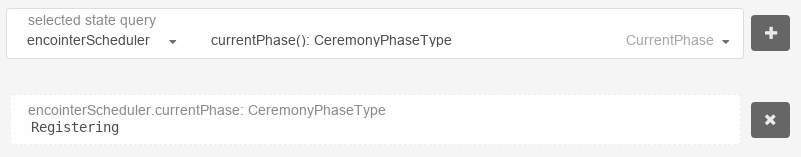

# Testnet Gesell Tutorial
## Connect!

You may watch Gesell working by navigating to [polkadot.js.org/apps](https://polkadot.js.org/apps). Then you connect to our node by setting our custom endpoint at Settings -> General


Hit "save" and you should see something like this in the upper left corner


There we go!

If you're interested in node statistics, please refer to  [telemetry.polkadot.io](https://telemetry.polkadot.io/#list/Encointer%20Testnet%20Gesell)

## Explore!

Gesell features regular ceremonies every 30min (Whereas the vision for mainnet is every 41 days). You can query the current ceremony phase below Chain State 



Registering means that participants can now register for the next ceremony

## Play!

But now you'd like to play with it, right? So get our cli client and start playing! The following instructions start from prebuilt binaries for ubuntu 18.04. If you use some other OS, you will have to build the client yourself.

```bash
> mkdir test
> cd test
> wget https://github.com/encointer/encointer-node/releases/download/v0.2.0/encointer-client
> chmod u+x encointer-client
> ./encointer-client wss://gesell.encointer.org get-phase
# you should see either of REGISTERING, ASSIGNING or ATTESTING
# for simplicity, we'll create an alias for the client
> alias nctr="./encointer-client wss://gesell.encointer.org"
# let's create a new account
> nctr new-account
5EcDWHsGzERpiP3ZBoFfceHpinBeifq5Lh1VnCkzxca9f9ex
# you can now check that your local keystore has a new entry
> ls my_keystore
73723235ae365cf166bab30448f25b3751b06d034be9c992a8ba5501d3adcde640ab9b1e
> nctr get-balance 5EcDWHsGzERpiP3ZBoFfceHpinBeifq5Lh1VnCkzxca9f9ex
ERT balance for 5EcDWHsGzERpiP3ZBoFfceHpinBeifq5Lh1VnCkzxca9f9ex 0
```

As with other blockchains, you'll need some funds in order to pay fees. As you can read in our whitepaper, we'll avoid this entry barrier in the future. We have a faucet in place that gets you started immediately:

```bash
> nctr fund-account 5EcDWHsGzERpiP3ZBoFfceHpinBeifq5Lh1VnCkzxca9f9ex
```

Should the faucet be exhausted, please post a message to our riot channel and friendly request some topup. Please be patient. 

```bash
> nctr get-balance 5EcDWHsGzERpiP3ZBoFfceHpinBeifq5Lh1VnCkzxca9f9ex
ERT balance for 5EcDWHsGzERpiP3ZBoFfceHpinBeifq5Lh1VnCkzxca9f9ex is 998999854
# now you could send around your new ERT
> nctr transfer 5EcDWHsGzERpiP3ZBoFfceHpinBeifq5Lh1VnCkzxca9f9ex 5G18LaJA315RwJqtYYbWrbE52g9FEQCgBYN1A1XG66XnKAw5 123456789
```

## Bootstrap your own currency

Now that we have some funds to pay platform fees, we can start our own local currency and bootstrap a bot population! 
Define Meetup Locations

First of all, we need to define in what region the currency shall be issued. For this we use the geojson standard to define a set of meetup places and add some meta-information about the currency. You can use geojson.io to select meetup places on a map (define a few "Points"). Make sure that you select places that are >100m apart. You also need to keep this minimal distance from other registered currencies. You can list all registered currencies with

```bash
> nctr list-currencies
```

The number of locations that you should define depends on the size of the population N you'd like to bootstrap. As a rule of thumb, there should be at least N locations in order to guarantee reasonable randomization. As a maximum of 12 people can attend the same meetup the hard lower limit is N/12. 

## Trusted Setup

Every local currency needs a trusted setup. A trustworthy group of 3-12 local people will hold the bootstrapping ceremony publicly. These bootstrappers need to be defined in the metadata block:
```json
{
  "type": "FeatureCollection",
  "currency_meta": {
    "name": "minimal mediterranean test currency",
    "bootstrappers": [
      "5EcDWHsGzERpiP3ZBoFfceHpinBeifq5Lh1VnCkzxca9f9ex",
      "5Dy4K5eNr13D37NcMcq4ffQZBAmt9BZhkgi5kBGuUWwK8cB7",
      "5GCdWmdr5eZRvRPx6XE8YxFD472EvSMSTK6GQCHyuiNnw7rK"
    ]
  },
  "features": [
    {
      "type": "Feature",
      "properties": {},
      "geometry": {
        "type": "Point",
        "coordinates": [
          11.25,
          40.03182061333687
        ]
      }
    }
  ]
}
```

As one of the bootstrappers, you can now save the above to minimal.json and register your new currency:
```bash
> nctr new-currency minimal.json 5EcDWHsGzERpiP3ZBoFfceHpinBeifq5Lh1VnCkzxca9f9ex
HKKAHQhLbLy8b84u1UjnHX9Pqk4FXebzKgtqSt8EKsES
```

Your currency has been registered and the return value is your currency-identifier (cid). Let's check the registry again:

```bash
> nctr list-currencies
number of currencies:  1
currency with cid HKKAHQhLbLy8b84u1UjnHX9Pqk4FXebzKgtqSt8EKsES
```

In order to bootstrap your bot currency, You'll need to fund all bootstrappers and register all of them

```bash
#check if phase is REGISTERING
> nctr get-phase
REGISTERING
# ok, let's register, but first we will define a few variables and a new alias
> alias nctr="./encointer-client wss://gesell.encointer.org --cid HKKAHQhLbLy8b84u1UjnHX9Pqk4FXebzKgtqSt8EKsES"
> account1=5EcDWHsGzERpiP3ZBoFfceHpinBeifq5Lh1VnCkzxca9f9ex
> account2=5Dy4K5eNr13D37NcMcq4ffQZBAmt9BZhkgi5kBGuUWwK8cB7
> account3=5GCdWmdr5eZRvRPx6XE8YxFD472EvSMSTK6GQCHyuiNnw7rK
> nctr register-participant $account1
> nctr register-participant $account2
> nctr register-participant $account3
# if everything goes well, you should find your registrations here:
> nctr list-participant-registry
listing participants for cid HKKAHQhLbLy8b84u1UjnHX9Pqk4FXebzKgtqSt8EKsES and ceremony nr 38
number of participants assigned:  3
ParticipantRegistry[38, 1] = 7080e1799d2e646d8b3f9e7eab53b2f011476d6fd4abe3ac69aa039bf3f11440 (5EcDWHsG...)
ParticipantRegistry[38, 2] = b6fc46e65b3b24af03845fa12917668863db7b5bd46d6125643170400ca25c41 (5GCdWmdr...)
ParticipantRegistry[38, 3] = 5429da7a940f960b9a79cb1b7889142b8ee209b7f43ac5953df9c56f1bc0a726 (5Dy4K5eN...)
```

Now you'll have to wait ~10min until the ceremony phase turns to ASSIGNING. The blockchain then assigns all participants to randomized groups that will have to meet at a random meetup location at a specific time. Participants can learn their assignment with:

```bash
> nctr list-meetup-registry
listing meetups for cid HKKAHQhLbLy8b84u1UjnHX9Pqk4FXebzKgtqSt8EKsES and ceremony nr 38
number of meetups assigned:  1
MeetupRegistry[38, 1] location is Some(Location { lat: 40.0318206134, lon: 11.25 })
MeetupRegistry[38, 1] meeting time is Some(1586541900000)
MeetupRegistry[38, 1] participants are:
   7080e1799d2e646d8b3f9e7eab53b2f011476d6fd4abe3ac69aa039bf3f11440 (5EcDWHsG...)
   b6fc46e65b3b24af03845fa12917668863db7b5bd46d6125643170400ca25c41 (5GCdWmdr...)
   5429da7a940f960b9a79cb1b7889142b8ee209b7f43ac5953df9c56f1bc0a726 (5Dy4K5eN...)
```

The ceremony phase will change to ATTESTING before the date of the ceremony. 

An encointer ceremony happens at high sun on the same day all over the world. This way, no single person can attend more than one meetup. At each meetup, participants attest each others personhood. For this testnet, however, we don't care about real time or physical presence as we're testing with bot communities. See [Time Warping](./testnets.html#time-warping-for-testnets) to learn how the timing maps between mainnet and Gesell.

Our bot communities can perform meetups simply with the following lines. In later networks, a mobile app will be used (similar to what we demonstrated in PoC1).

```bash
# each participant generates a claim of attendance including her vote on how many people N are actually physically present at that moment
> claim1=$(nctr new-claim $account1 3)
> claim2=$(nctr new-claim $account2 3)
> claim3=$(nctr new-claim $account3 3)
# this claim is then sent to all other participants who will verify them and sign an attestation 
> witness1_2=$(nctr sign-claim $account1 $claim2)
> witness1_3=$(nctr sign-claim $account1 $claim3)
> witness2_1=$(nctr sign-claim $account2 $claim1)
> witness2_3=$(nctr sign-claim $account2 $claim3)
> witness3_1=$(nctr sign-claim $account3 $claim1)
> witness3_2=$(nctr sign-claim $account3 $claim2)
# and send that attestation back to the claimant who assembles all attestations and sends them to the chain
> nctr register-attestations $account1 $witness2_1 $witness3_1
> nctr register-attestations $account2 $witness1_2 $witness3_2
> nctr register-attestations $account3 $witness1_3 $witness2_3
```

Now you have to wait for the ceremony phase to become REGISTERING. Then we can verify that our bootstrapping was successful and our bootstrappers have received their basic income issue on their accounts in units of the new currency (beware that we still use the alais including our cid. This means we're not querying ERT token balance, but the balnce in your new local currency). 

```bash
> nctr get-balance $account1
NCTR balance for 5EcDWHsGzERpiP3ZBoFfceHpinBeifq5Lh1VnCkzxca9f9ex is 0.99999932394375560185 in currency HKKAHQhLbLy8b84u1UjnHX9Pqk4FXebzKgtqSt8EKsES
```

Your new currency has a very special property called [demurrage](./eceonomy-demurrage.md). This means that the nominal value of your holdings decreases over time. Currently it is halving every year. You can observe this by waiting for a few blocks and checking your balance again. Think of this demurrage like a solidarity fee that you pay to the decentralized "state" that takes care of redistributing wealth among the local population at every ceremony as newly issued basic income.

## What's next?

Now that you bootstrapped your community currency, you should grow your population. At every subsequent ceremony you can add a few participants more but it is important to maintain reputation. At least 3/4 of all participants need to have attended the previous ceremony. So you can only grow your population at a pace that allows to build reputation.
