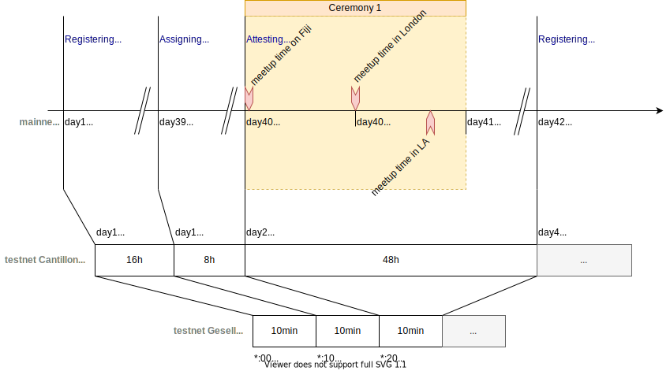

# Testnets

Encointer maintains two testnets: Gesell and Cantillon.

The networks differ in their goals and designs:

## Gesell

Aimed at automated testing of the protocol.

* Time-warping allows to script bot populations and hold ceremonies every 30min.
* Complete transparency of all registries and balances. Everything happens on-chain.

## Cantillon

The main purpose of Cantillon is to test our mobile phone app and privacy features.
Aimed at experimenting with real ceremony meetups, physically meeting people.
Bot communities can still be grown but we expect them to be loctated in off-shore locations in order not to interfere with physical communities. 

* Accelerated ceremony schedule to avoid long wait times. Ceremonies every three days.
* Privacy enhancement through Trusted Execution environments (with enclaves still in development mode, so privacy is not guaranteed before we move to production mode)

Cantillon is planned to become a parachain to [Kusama](https://kusama.network/)

Watch our [demo video on bootstrapping a bot community](https://youtu.be/X1Zb68Z1fac)

## Outlook on Mainnet

The mainnet is planned to become a parachain of [Polkadot](https://polkadot.network/). The security will depend on polkadot relay chain. 

## Time Warping for Testnets

In order to understand the different timing on our networks, we offer the following figure:



## Testing Cantillon's Teeproxy System Locally 

You can run an entire Demo locally on any properly set up SGX machine. This is for advanced users or developers. The instructions assume that you are able to build substrate blockchains.

### Build client and worker 

along the [substraTEE-worker instructions](https://www.substratee.com/howto_worker.html). With the following differences:
```console 
git clone https://github.com/encointer/encointer-worker.git
cd encointer-worker
./ci/install-rust.sh
make
```
Because the enclave cannot yet be built deterministically, you'll have to use our build if you intend to serve the same shards that we do (feel free to start new currencies on your own shard with different MRENCLAVE, but you won't be able to process the state of our/other shards):

```
cd bin
wget https://github.com/encointer/encointer-worker/releases/download/v0.6.11-sub2.0.0-alpha.7/enclave-0.6.11-devsgx02.signed.so
rm enclave.signed.so
ln -s enclave-0.6.11-devsgx02.signed.so enclave.signed.so
```
Moreover, you will need to provision secrets (the *shielding key* and the *state encryption key*) to the enclave. In the future, this will be done by workers automatically mutually, as demonstrated in [SubstraTEE M3](https://www.substratee.com/design.html#redundancy-m3-onwards).

```
# still inside ./bin
# get our symmetric state encryption key
wget https://github.com/encointer/encointer-worker/releases/download/v0.6.10-sub2.0.0-alpha.7/aes_key_sealed.bin
# get our RSA shielding key
wget https://github.com/encointer/encointer-worker/releases/download/v0.6.10-sub2.0.0-alpha.7/rsa3072_key_sealed.bin
```

### Build node 

along the [substraTEE-node instructions](https://www.substratee.com/howto_node.html#build). With the following differences:

```console
git clone https://github.com/encointer/encointer-node.git
cd encointer-node
git checkout sgx-master
cargo build --release
```

Run dev node locally

```console
..encointer-node# ./target/release/encointer-node-teeproxy --dev --ws-port 9979
```

Run dev worker with a few insightful logs locally

```bash
cd encointer-worker/bin
./encointer-worker init-shard
./encointer-worker shielding-key
./encointer-worker signing-key
export RUST_LOG=info,substrate_api_client=warn,sp_io=warn,ws=warn,encointer_worker=info,substratee_worker_enclave=debug,sp_io::misc=debug,runtime=debug,substratee_worker_enclave::state=warn,substratee_stf::sgx=debug
./encointer-worker -p 9979 run
```
