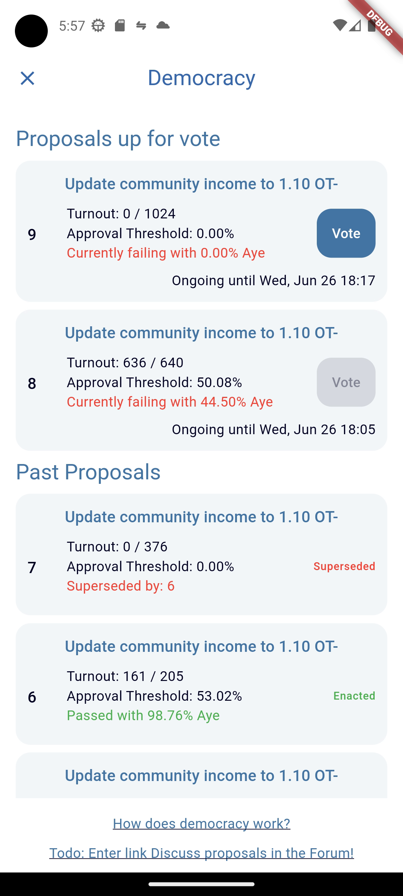

# Democracy Tutorial

Encointer is about distribution of power - both economically and in terms of governance. Therefore, communities can govern their own protocol parameters with an approximation of universal suffrance. This tutorial takes you through the process of proposing a change and voting on proposals.

We assume you already have 
* [set up the CLI client](./tutorials-cli.md)
* [registered a community](./tutorials-register-community.md)
* [performed a virtual cycle gathering](./tutorials-perform-cycle.md)

## What can you vote on?

Please read our [democracy documentation](./protocol-democracy.md) to learn the details. In this tutorial, we will focus on [local community governance](./protocol-democracy.md#community-actions), like changinging the community income amount issued per cycle.

## Who can vote

Every reputable can vote on matters in the community where they have repuation. The current implementation grants reputables one vote per cycle attendance. This is a sybil-resilient approximation of universal suffrance and it gives those more voting power who engage more in cycles. 

In the following, we will assume that one person only maintains one account. The protocol is sybil-resilient even if that's not the case, but the tutorial will be easier to follow with this assumption.

### Quorum

Let's find out how many votes can maximally be cast for our community

First, how many different accounts have reputation?

```bash
nctr-gsl ceremony list-reputables
# Listing the number of attested attendees for each community and ceremony for cycles [4607:4943]
# ...
# Community ID: srcq45PYNyD
# ...
# Cycle ID 4942: Total attested attendees: 3 (noshows: 0)
# Cycle ID 4943: Total attested attendees: 3 (noshows: 1)
# ...
# Reputables in srcq45PYNyD (unique accounts with at least one attendance) 4
```
Our test community has 4 reputable members who are eligible to vote. The quorum of votes will be the sum of attested attendances, in this case 6. Two accounts will have a voting power of 2, because they attended both cycles 4942 and 4943. Another two accounts have a voting power of 1 

Reputation becomes eligible for voting with 1 cycle delay. If you came here straight after the previous tutorial, you may need to wait for one cycle (30min on Gesell) for your fresh reputation to become eligible.

Reputation loses its voting power after [ReputationLifetime](./protocol-reputation.md#reputation-lifetime)

For later reference, we list the 4 reputables here with their eligible votes:
* `5F77sGnUhpjdFnzruhurGZgqPFtvdECXTGgX4Bgy2zGavbEw` (bootstrapper with 1 vote) 
* `5FyWbcwN1TGPdyzRzoEeem3MUcc7jXRs7ZoftZkAQLV47nS7` (bootstrapper with 2 votes)
* `5CMVLJCC4Jn7QmLsFRkLWkm2w4LJswpZo1V2nd1tp64iVnCR` (bootstrapper with 2 votes)
* `5FH44YdjmxbXJCAn9DuwpXuz5h2S8zLn752Vn5CyDa3quwEs` (reputable with 1 vote)


## Submit Proposals

Anyone can submit a proposal anytime. See the [docs](./protocol-democracy.md#proposals) to learn about conflict resolution among proposals.

```bash
nctr-gsl democracy propose update-nominal-income 5FH44YdjmxbXJCAn9DuwpXuz5h2S8zLn752Vn5CyDa3quwEs 3.14 --cid srcq45PYNyD
nctr-gsl democracy proposal list
# id: 3 (reputation commitment purpose id: 3)
# action: ProposalAction::UpdateNominalIncome(srcq45PYNyD, 3.14000000000000012434)
# started at: 2024-03-24 15:58:48 UTC
# ends after: 2024-03-24 16:18:48 UTC
# start cindex: 4954
# current electorate estimate: 6
# state: ProposalState::Ongoing
```

So now we have at most 30min time to vote. 

## Vote

Let's check our voting power:
```bash
nctr-gsl ceremony participant reputation 5FH44YdjmxbXJCAn9DuwpXuz5h2S8zLn752Vn5CyDa3quwEs
# 4943, srcq45PYNyD, Reputation::VerifiedUnlinked
```
We have one vote in community srcq45PYNyD with our reputation from cindex 4943. We need this information to cast our vote:

```bash
nctr-gsl democracy vote 5FH44YdjmxbXJCAn9DuwpXuz5h2S8zLn752Vn5CyDa3quwEs 3 aye srcq45PYNyD_4943
nctr-gsl democracy proposal list
# id: 3 (reputation commitment purpose id: 3)
# action: ProposalAction::UpdateNominalIncome(srcq45PYNyD, 3.14000000000000012434)
# started at: 2024-03-24 15:58:48 UTC
# ends after: 2024-03-24 16:18:48 UTC
# start cindex: 4954
# current electorate estimate: 6
# state: ProposalState::Confirming { since: 1711296000000 }
# confirming since: 2024-03-24 16:00:00 UTC until 2024-03-24 16:00:00 UTC
```
The proposal will immediately enter the confirming phase which lasts 5min

If no one else votes, it will be approved because in this case our vote is already more than 5% of the electorate. Please check [our docs on adaptive quorum biasing](./protocol-democracy.md#adaptive-quorum-biasing-aqb-and-minimum-approval)

Proposals are lazily evaluated. after the end of the confirming phase you can call

```bash
nctr-gsl democracy proposal update-state 5FH44YdjmxbXJCAn9DuwpXuz5h2S8zLn752Vn5CyDa3quwEs 3
nctr-gsl democracy proposal list
# id: 3 (reputation commitment purpose id: 3)
# action: ProposalAction::UpdateNominalIncome(srcq45PYNyD, 3.14000000000000012434)
# started at: 2024-03-24 15:58:48 UTC
# ends after: 2024-03-24 16:18:48 UTC
# start cindex: 4954
# current electorate estimate: 6
# state: ProposalState::Approved
```

All approved proposals will be enacted automatically at the start of the next *Registering* phase. Let's check the enactment queue:

```bash
nctr-gsl democracy enactment-queue
# 3
```

This returns all proposal id's which will be enacted. Please be aware that even approved proposals can be cancelled before enactment if another proposal for the same action passes before enactment. However, after the first proposal for an action type has been approved, submitting new proposals will fail with `encointerDemocracy.ProposalWaitingForEnactment` until the approved proposal has been enacted.

After the start of the next *Registering* phase, let's verify the enactment:

```bash
nctr-gsl democracy proposal list
# id: 3 (reputation commitment purpose id: 3)
# action: ProposalAction::UpdateNominalIncome(srcq45PYNyD, 3.14000000000000012434)
# started at: 2024-03-24 15:58:48 UTC
# ends after: 2024-03-24 16:18:48 UTC
# start cindex: 4954
# current electorate estimate: 6
# state: ProposalState::Enacted
```
And the community income has indeed changed:

```bash
nctr-gsl community list
# ...
# srcq45PYNyD: Adriana, locations: 5, nominal income: 3.14000000000000012434 ADR, demurrage: 0/block, CommunityRules::LoCo
```

### Vote Using the Mobile App

We have implemented a first mininimum viable product in the Encointer Wallet app. 

To access this beta feature, you need to enable developer mode and connect to testnet Gesell or your local instance which you could populate with bot-communities.



## Deep Dive

How do we ensure that every cycle attendance can only be used once for voting on a proposal but the same reputation can be used to vote on other proposals?

We solve this using *commitments* for *purposes*. Every proposal is its own purpose. Let's check purposes on Gesell:

```bash
nctr-gsl personhood commitment purposes
# 0: ectrfct0GesellPioneerPot
# 1: democracyProposal1
# 2: democracyProposal2
# 3: democracyProposal3
# 4: democracyProposal4
```

As you can see, proposals are not the only possible purposes. Each [faucet](./tutorials-faucets.md) is its own purpose too. Any use case that requires sybil-resilience can use these commitments. See [our article on more use cases for social media](https://encointer.org/one-human-one-account-how-encointer-can-help-tackle-review-and-comment-fraud/). 

If we want to learn more about the commitments for a specific purpose like our proposal above, we need to know its purpose index. we can use `democracy proposal list` and it will tell us each proposals' purpose_id: `Proposal id: 3 (reputation commitment purpose id: 3)` 

```bash
nctr-gsl personhood commitment list --purpose-id 3 --cid srcq45PYNyD
# srcq45PYNyD, 4943, 3, 5FH44YdjmxbXJCAn9DuwpXuz5h2S8zLn752Vn5CyDa3quwEs, None
```

This should list your previous vote(s) and those of anyone else who voted on the same proposal. As you see, voting is not private (yet) because your pseudonymous account is visible to anyone. 

